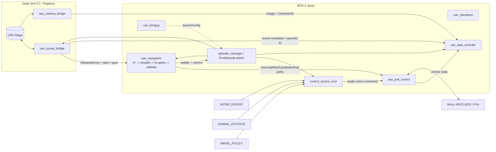
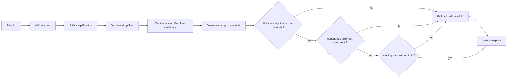
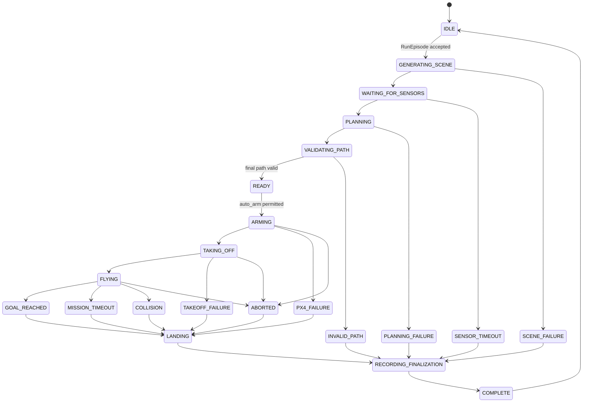

# 目標 ROS 2 架構與 Phase 0 ADR

本架構以增量遷移為原則：先把 pure planning/safety code與typed contracts建立起來，再逐步替換 `builtins` 和 direct PX4 control。任何階段都保留可回退的已驗證 path與legacy runner。

## 1. Canonical source layout

```text
uav-project/
├── legacy/                         # 等價驗證後才移入；Phase 0不移動
├── ros2_isaac_scripts/             # 現有Isaac-side fallback
├── ros2_ws/
│   └── src/
│       ├── uav_interfaces/
│       ├── uav_scene_bridge/
│       ├── uav_camera_bridge/
│       ├── uav_navigation/
│       ├── uav_px4_control/        # 延伸現有0.5.0 package，不另造同名功能
│       ├── uav_data_recorder/
│       └── uav_bringup/
└── docs/
```

`~/uav_ros2_ws` 保留為 runtime build/install workspace。canonical source必須由本 repository追蹤；在原外部 package未被snapshot並通過build前，不修改或移除它。

## 2. Component architecture



## 3. Package decisions

### `uav_interfaces`

只新增 standard messages無法表示的 contracts：

- `Obstacle.msg`、`ObstacleArray.msg`
- `EpisodeState.msg`
- `GenerateEpisode.srv`
- `RunEpisode.action`

若需要回報B-spline reject reason，優先用diagnostic/status message或EpisodeState detail，不為每個布林值建立custom message。

### `uav_scene_bridge`

- `/World/GeneratedEpisode` 是唯一generated root。
- USD stage 是obstacle geometry source of truth。
- `GenerateEpisode` request傳seed/count/record flag。
- publish start/goal (`PoseStamped`)、obstacles (`ObstacleArray`)、episode ID。
- scene metadata JSON/CSV格式保留並加schema version/frame ID。
- regenerate前向episode manager/PX4 state確認未armed且episode非active。
- 第一階段包裝現有generator；等tests穩定才抽更多Isaac-specific code。

### `uav_camera_bridge`

- camera prim與controller保留。
- Isaac 5.1首選現有已工作的Replicator off-screen render products；不依active viewport。
- publish：
  - `/uav/fpv/image_raw`
  - `/uav/fpv/camera_info`
  - `/uav/observer/image_raw`
  - `/uav/observer/camera_info`
- frame IDs固定 `uav_fpv_camera`、`uav_observer_camera`。
- 同一render event的image/header使用同一sim-time stamp。
- PNG debug output為parameter，不是node間coupling。

### `uav_navigation`

```text
uav_navigation/
├── coordinate_frames.py
├── obstacle_geometry.py
├── astar_planner.py
├── path_simplifier.py
├── bspline_smoother.py
├── path_validator.py
├── path_metrics.py
└── astar_planner_node.py
```

pure modules不得import Isaac、rclpy或pymavlink。ROS node只做message轉換、parameter、QoS與publication。

Safety envelope定義集中在 `obstacle_geometry.py`；至少包含physical radius、static margin、segment margin與明確的grid discretization policy。現有 bounding circle與2.5D overflight在首個milestone保持。

### `uav_px4_control`

- 延伸現有0.5.0 follower的ACK、freshness、failsafe與landing邏輯。
- 實際topic與fields鎖定 `px4_msgs v1.14.0`；live PX4運行後再確認DDS graph。
- 唯一PX4 command publisher應是低階offboard node；expert/joystick/NavRL不再直接發 `/fmu/in/*`。
- final path只從 `/uav/planner/path` 消費。
- `auto_arm=false`預設；path valid、odometry fresh、VehicleStatus與bridge healthy、mux source有效後才允許arm。

### Control-source mux

sources：`ASTAR_EXPERT`、`HUMAN_JOYSTICK`、`NAVRL_POLICY`、`HOLD`。

- 各source發到不同input topic，帶timestamp/validity。
- mux一次只輸出一個source，所有transition寫log並發active source。
- source stale或invalid立即轉 `HOLD`。
- source selection不能繞過flight state machine或safety stop。
- NavRL本階段只定deployment observation/action contract與scaling。

### `uav_data_recorder`

- rosbag2是完整原始record。
- approximate synchronization產生ML manifest。
- 一個episode ID貫穿scene、images、vehicle state、commands、paths與metrics。
- control source是每筆sample必填，區分expert/human/NavRL。
- optional PNG extraction由bag或image callback完成，不用 `builtins`。
- episode metadata JSON與metrics CSV帶schema version與Git commit。

### `uav_bringup`

主要入口：

```bash
ros2 launch uav_bringup astar_bspline_episode.launch.py
```

另有scene_camera、planning_visualization、px4_controller、joystick、full_episode launch。所有launch預設不得auto-arm。

## 4. Planner與B-spline safety pipeline



必要 invariants：

1. exact start/goal必須在final path保留。
2. 2/3個control points自動降degree或bypass；不得因點數少產生NaN。
3. candidate sampling spacing是validation parameter；不得只檢sample points，還要檢每一sample segment。
4. collision threshold不得比simplified A* validator寬鬆。
5. curvature/map bounds/non-finite任何一項失敗都fallback，不得發布unsafe candidate為final。
6. candidate仍可發布供debug，但 `/uav/planner/bspline_valid=false` 且reason需記錄。
7. final selected path再做一次完整validator，避免selection bug。

Topic set：

- `/uav/planner/path_raw`
- `/uav/planner/path_simplified`
- `/uav/planner/path_bspline_candidate`
- `/uav/planner/path`
- `/uav/planner/bspline_valid`
- `/uav/planner/markers`

marker namespaces：`astar_raw`、`astar_simplified`、`bspline_candidate`、`path_final`。

## 5. Coordinate/frame contract

首個milestone保持現有mapping：

```text
Isaac world [x, y, z] <-> PX4 local NED [y, x, -z]
```

但只能由 `coordinate_frames.py` 實作，且tests需包含round trip、offset與姿態/heading的明確策略。ROS messages必須標示：

- scene geometry原始frame：`isaac_world`
- planner/PX4 path：`px4_ned`
- cameras：`uav_fpv_camera`、`uav_observer_camera`

不允許空 `frame_id`。在沒有完整TF前，不把 `isaac_world` 稱為標準ENU。

## 6. Episode state machine



實作時failure state是否進LANDING取決於armed/landed狀態；未armed時直接HOLD/finalize，不可無條件發LAND。

## 7. Migration sequence與每階段gate

1. Interfaces：只build/interface lint；不啟動flight。
2. Pure navigation extraction：以legacy golden inputs比較raw/simplified path與safety result。
3. B-spline：完成2/3/4+點、collision fallback、curvature與endpoint tests。
4. Scene bridge：fixed seed non-flight test，驗證USD metadata→ObstacleArray。
5. Camera bridge：synthetic/off-screen frame與CameraInfo；不依GUI viewport。
6. PX4 controller + mux：synthetic messages測stale/exclusivity/state；不連PX4。
7. Recorder：synthetic synchronized sample、bag metadata與manifest。
8. Bringup：launch tests，`auto_arm=false`。
9. Isaac + PX4 integration：先planning-only，再手動允許auto-arm。
10. 固定seed A* vs A*+B-spline各5 episodes與metrics comparison。

每一階段必須有獨立commit、實際命令與pass/fail輸出；warning不得隱藏。

## 8. 測試策略

Pure unit tests：coordinate round-trip、inflation、point-segment distance、A* validity、endpoint preservation、B-spline degree handling/non-finite/collision/fallback/curvature、stale command、mux exclusivity、state transitions。

Non-flight integration：fixed-seed scene metadata、raw A*、candidate、final selection、synthetic synchronized recorder sample。

Flight integration prerequisites：

- selected final path valid
- live odometry fresh
- VehicleStatus/bridge confirmed
- only muxed controller owns PX4 inputs
- `auto_arm=true`由operator明確設定
- recorder與abort/hold/land path ready

## 9. Phase 0明確不做的設計擴張

- 不把NavRL training搬進ROS 2。
- 不先改矩形obstacle為更激進的polygon planner。
- 不安裝SciPy到Isaac環境。
- 不刪除或搬動legacy scripts。
- 不自動arm/flight。
- 不把目前只有靜態審閱的流程寫成integration已成功。
