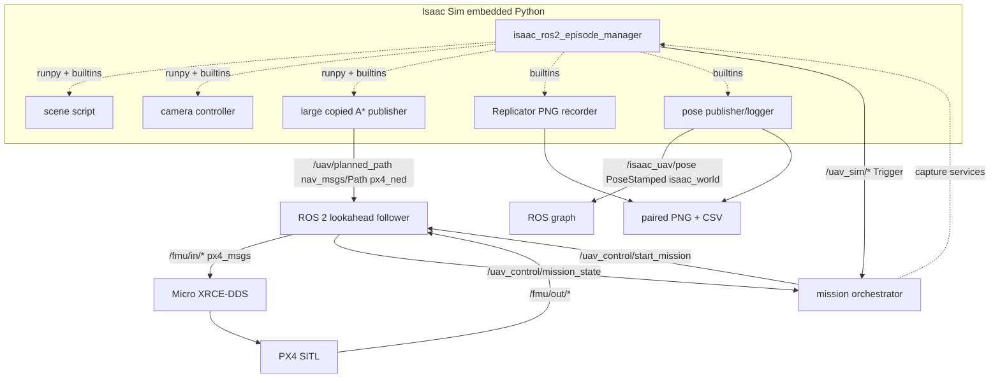
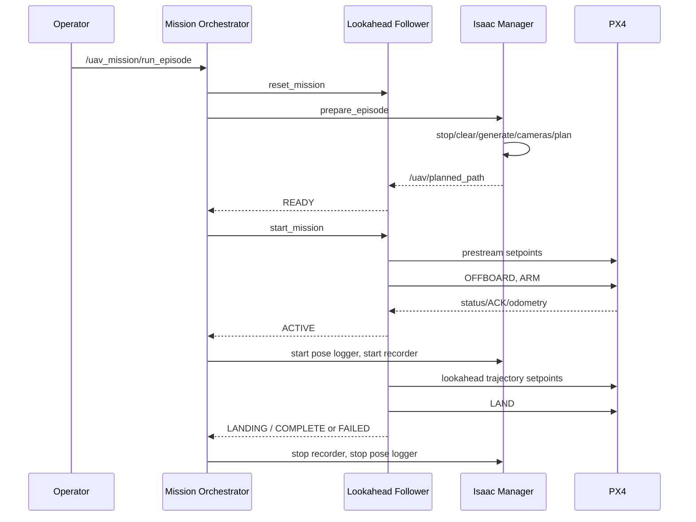

# Historical UAV pipeline audit

本文件描述 2026-08-05 審計時真正存在的兩條 pipeline。它不是目標設計，也不把未運行的元件寫成已驗證成功。
這些實作已由後續 ROS 2/PX4/Isaac milestones 取代，現保留於
`legacy/` 供追溯，不是目前的啟動說明。

## 1. Legacy direct-pymavlink pipeline

入口是 Isaac Script Editor 的 wrapper 或
`legacy/pipeline/launch_uav_pipeline.py`。

```mermaid
flowchart LR
    USD[Isaac USD Stage] --> SG[2.scene_episode_generator.py]
    SG --> ROOT[/World/GeneratedEpisode]
    BODY[/World/quadrotor/body] --> CAM[1.dual_uav_camera.py]
    CAM --> FPV[/World/UAV_Camera_FPV]
    CAM --> OBS[/World/UAV_Camera_Observer]
    ROOT --> ASTAR[4.px4_astar.py]
    ASTAR --> SAFE[Inflated A* + simplify + segment validation]
    SAFE --> FOLLOW[Lookahead / carrot follower]
    FOLLOW --> MAV[pymavlink UDP :14550]
    MAV --> PX4[PX4 SITL / Pegasus]
    FPV --> REC[PNG recorder]
    OBS --> REC
    ASTAR -. builtins start/stop .-> REC
    ASTAR --> CSV[mission CSV]
    SG --> SCENELOG[scene JSON + CSV]
    REC --> IMAGES[FPV/TOP PNG + camera_frames.csv]
```

執行順序：

1. scene generator 清除舊 `/World/GeneratedEpisode`，建立 obstacles、start、target與 scene logs。
2. dual-camera controller 建立並持續更新 FPV/observer camera prims。
3. A* runner從 live stage讀 obstacle與 target。
4. planner 把 Isaac座標轉 NED，在固定 2 m高度規劃。
5. A* path經 RDP/greedy/raw fallback與 continuous segment validation。
6. safe path成立後才連 PX4；prestream、OFFBOARD、ARM、takeoff、lookahead follow、land。
7. recorder與 mission logger各自以CSV/PNG落盤。

重要安全 invariant：planner不能產生通過 segment validation的 path時，runner在 PX4 connection前 return。

### Legacy state

`legacy/isaac_direct_pipeline/4.px4_astar.py` 使用鬆散字串 phase：takeoff、mission、auto_land_wait、landing、hover、stopped。它沒有單一 published EpisodeState，也沒有所有規格要求的 failure states。

### Legacy coupling

Isaac components共享同一 Python process，以下 lifecycle依賴 `builtins`：

- camera controller
- front/dual recorder
- pose logger
- A* ROS publisher
- episode manager

這能讓 Script Editor重跑，但 ownership、錯誤傳播與同時執行控制不夠明確。

## 2. 現有半 ROS 2 pipeline

當時的 shell wrapper 現保留於 `legacy/pipeline/uav_pipeline.sh`，它假設已有名為 `uav` 的固定 tmux pane layout。這段描述是歷史狀態；目前 Phase 9 bootstrap 是 `isaac/runtime/bootstrap.py`，且不再啟動舊 episode manager。



### Episode sequence



## 3. 現有 ROS interface surface

### Topics

| Topic | Type | Producer | Consumer / 用途 |
|---|---|---|---|
| `/uav/planned_path` | `nav_msgs/Path` | Isaac A* publisher | lookahead follower |
| `/isaac_uav/pose` | `geometry_msgs/PoseStamped` | Isaac pose logger | logging/inspection |
| `/uav_sim/status` | `std_msgs/String` | Isaac manager | status |
| `/uav_sim/episode_id` | `std_msgs/String` | Isaac manager | BC/dataset nodes |
| `/uav_control/mission_state` | `std_msgs/String` | follower | orchestrator |
| `/uav_mission/state` | `std_msgs/String` | orchestrator | operator/status |
| `/fmu/in/offboard_control_mode` | `px4_msgs/OffboardControlMode` | follower或joystick | PX4 |
| `/fmu/in/trajectory_setpoint` | `px4_msgs/TrajectorySetpoint` | follower或joystick | PX4 |
| `/fmu/in/vehicle_command` | `px4_msgs/VehicleCommand` | follower或joystick | PX4 |
| `/fmu/out/vehicle_local_position` | `px4_msgs/VehicleLocalPosition` | PX4 | follower/joystick |
| `/fmu/out/vehicle_odometry` | `px4_msgs/VehicleOdometry` | PX4 | follower |
| `/fmu/out/vehicle_status` | `px4_msgs/VehicleStatus` | PX4 | follower |
| `/fmu/out/vehicle_command_ack` | `px4_msgs/VehicleCommandAck` | PX4 | follower |
| `/fmu/out/vehicle_land_detected` | `px4_msgs/VehicleLandDetected` | PX4 | follower |

### Services

- `/uav_sim/{prepare_episode,cleanup,generate_scene,setup_cameras,start_recording,stop_recording,start_pose_logger,stop_pose_logger,plan_path,stop_all,get_status}`
- `/uav_control/{start_mission,reset_mission,abort_mission,get_status}`
- `/uav_mission/{run_episode,abort,get_status}`

全部使用 `std_srvs/srv/Trigger`，所以 scene seed、obstacle count、controller source、recording與B-spline選項不能作 typed request。

## 4. 現行資料輸出

| 輸出 | 位置 | 時間/同步狀態 |
|---|---|---|
| scene JSON/CSV | `uav_demo_logs/scene_episodes` | episode timestamp/seed；非ROS stamp |
| paired FPV/TOP PNG | `uav_vision_dataset/dual_camera_<episode>` | 相同 frame row；sim time優先 |
| camera manifest | `camera_frames.csv` | wall、record、sim time與 image paths |
| Isaac pose CSV | `ros2_uav_pose_logs` | wall、record、sim、ROS stamp |
| legacy mission CSV | `uav_episode_logs` | wall/mission time；NED state/command/path metrics |
| rosbag | 有歷史 sample | 現行 episode orchestration未自動錄完整topic set |

相機與 pose可用 episode ID + sim time後處理對齊，但還不是 ROS message_filters approximate synchronization，也沒有一列完整 imitation-learning sample包含 image、state、goal-relative state、expert action與control source。

## 5. 現行 failure handling

已存在：

- invalid/missing path不開始 flight
- stale position後 mission fail並視 armed/landed狀態要求 LAND
- PX4 failsafe、OFFBOARD loss、unexpected disarm會 fail
- command ACK fatal result處理
- landing confirmation與timeout
- orchestrator service timeout、mission timeout、abort cleanup
- joystick deadman與stale input零速度

不存在或不完整：

- scene regeneration的 armed/episode-active cross-process interlock
- control-source exclusivity
- obstacle/collision topic與collision failure
- camera/pose/path source health統一監控
- typed EpisodeState與完整failure enum
- planner/smoother rejection reason的ROS contract
- PX4 bridge loss與DDS liveliness的明確區分

## 6. 保留策略

- 根目錄 direct-`pymavlink` runner保持可用，直到ROS 2 controller通過同場景integration flight。
- 現有 `uav_px4_control` safety state machine作為migration reference，不先刪或改名。
- Replicator recorder是camera migration起點；舊 viewport recorder只作legacy/debug。
- A* safety行為先用golden tests鎖定，再從大型腳本抽出。
- 所有 duplicate/backup在imports與launch等價確認前不搬到 `legacy/`。
